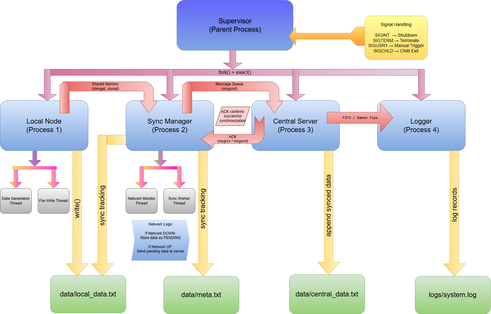

# Offline-First Edge Data Sync Engine (Embedded Linux)

---

## Problem Statement

This project implements an **offline-first data synchronization system** for an embedded/IoT edge device. The system continues to generate and store data locally when the network is unavailable and synchronizes all pending data with a central server once connectivity is restored.

In real-world embedded systems such as **industrial automation**, **vehicle monitoring**, **remote sensor nodes**, and **IoT devices**, internet/network failures are very common. If the device depends completely on network connectivity, important data may be lost.  
To solve this problem, this project uses an **offline-first architecture**, where data is safely stored locally and later synchronized when the network becomes available again.

This ensures:

- **No data loss**
- **Reliable local storage**
- **Delayed but guaranteed synchronization**
- **Robust embedded system behavior**

---

## Objectives

The main objectives of this project are:

- To design and implement an **offline-first data pipeline**
- To simulate a realistic **embedded Linux edge system**
- To use **multiple Linux processes**
- To implement **multi-threaded execution**
- To demonstrate **Inter-Process Communication (IPC)**
- To use **signals** for lifecycle handling
- To perform **low-level file operations**
- To simulate **network failure and recovery**
- To maintain **local persistence and eventual synchronization**

---

## System Overview

The project follows a **store-and-forward model**.

### Working Principle:

1. The **Local Node** continuously generates data.
2. If the network is unavailable, the generated data is stored locally.
3. That data is marked as **`PENDING`**.
4. The **Sync Manager** continuously checks the network status.
5. When the network becomes available, all pending data is sent to the **Central Server**.
6. The **Central Server** receives the data and stores it in a central file.
7. It sends an **ACK (Acknowledgment)** back to the Sync Manager.
8. The record is then marked as **`SYNCED`**.
9. All important events are recorded by the **Logger** process.

This design reflects a practical architecture used in **real embedded edge systems**.

---

## Features

- Offline-first design
- Multi-process Linux architecture
- Multi-threaded implementation
- Shared memory communication
- Message queue based synchronization
- Pipe/FIFO based logging
- Graceful shutdown using signals
- Local file-based persistence
- Central sync simulation
- Embedded Linux system design approach

---

## Linux Concepts Used

This project demonstrates several important Linux system programming concepts.

---

### 1. Process Management

The project uses multiple Linux processes created using system calls like:

- `fork()`
- `execl()`
- `wait()`
- `waitpid()`

Each major component runs as a separate process:

- Supervisor
- Local Node
- Sync Manager
- Central Server
- Logger

This reflects how real embedded Linux systems separate services into independent modules.

---

### 2. Threading

The project uses POSIX threads (`pthread`) to handle concurrent tasks inside processes.

Functions used:

- `pthread_create()`
- `pthread_join()`
- `pthread_mutex_lock()`
- `pthread_mutex_unlock()`

Threads are useful for:

- parallel data generation
- file writing
- network monitoring
- background synchronization

This improves responsiveness and modularity.

---

### 3. IPC (Inter-Process Communication)

This project uses multiple IPC mechanisms to demonstrate practical Linux communication patterns.

#### IPC methods used:
- **Shared Memory**
- **Message Queue**
- **Pipe**
- **FIFO (Named Pipe)**

Each one is used for a specific purpose.

---

### 4. Signals

The project uses Linux signals for system control and lifecycle handling.

Signals used:

- `SIGINT`
- `SIGTERM`
- `SIGUSR1`
- `SIGCHLD`

These signals help in:

- graceful shutdown
- process cleanup
- manual control
- child process management

---

### 5. File I/O

Low-level Linux file handling is used through system calls like:

- `open()`
- `read()`
- `write()`
- `close()`
- `lseek()`

Files are used for:

- local persistence
- central storage
- metadata
- logs

---

## Process Architecture

The system consists of the following processes:

---

### 1. Supervisor Process

The **Supervisor** is the parent process of the entire system.

#### Responsibilities:
- Starts all child processes
- Controls system lifecycle
- Handles signal-based shutdown
- Performs cleanup of IPC resources
- Waits for child process termination

It acts as the **main controller** of the project.

---

### 2. Local Node Process

The **Local Node** simulates an embedded edge device or sensor node.

#### Responsibilities:
- Generates random data continuously
- Stores generated data into local storage
- Marks records as `PENDING`
- Writes data to shared memory

This process simulates the **data-producing embedded device**.

---

### 3. Sync Manager Process

The **Sync Manager** is responsible for synchronization logic.

#### Responsibilities:
- Monitors network status
- Reads local pending data
- Transfers data to the central server
- Sends data using message queue
- Receives ACK from central server
- Updates sync status

This is the **core offline-first synchronization module**.

---

### 4. Central Server Process

The **Central Server** simulates a remote/cloud-side receiver.

#### Responsibilities:
- Receives synchronized data
- Stores received records in central storage
- Sends acknowledgment (ACK)
- Logs received sync events

This acts as the **final destination** of synchronized data.

---

### 5. Logger Process

The **Logger** process is responsible for event recording.

#### Responsibilities:
- Receives logs from other modules
- Writes logs into log files
- Helps debugging and monitoring

This improves **traceability and observability** of the system.

---

## Thread Architecture

Some processes internally use threads for parallel execution.

---

### Local Node Threads

#### a) Data Generation Thread
- Generates random sensor-like values continuously

#### b) File Write Thread
- Writes generated data into local file storage

---

### Sync Manager Threads

#### a) Network Monitor Thread
- Simulates network state changes
- Toggles between **UP** and **DOWN**

#### b) Sync Worker Thread
- Sends pending records to central server when network is available

---

## IPC Design (Detailed)

This project uses multiple IPC mechanisms to simulate realistic Linux communication.

---

### 1. Shared Memory

#### Used Between:
- **Local Node → Sync Manager**

#### Purpose:
- Fast communication of generated data

#### Why Shared Memory?
- Very fast
- Efficient for frequent data updates
- Common in embedded Linux systems

---

### 2. Message Queue

#### Used Between:
- **Sync Manager → Central Server**
- **Central Server → Sync Manager (ACK)**

#### Purpose:
- Structured communication for synchronization

#### Why Message Queue?
- Reliable message passing
- Supports asynchronous communication
- Good for queued data transfer

---

### 3. Pipe

#### Used For:
- Internal process communication / control flow

#### Why Pipe?
- Simple parent-child communication mechanism
- Demonstrates classic Linux IPC

---

### 4. FIFO (Named Pipe)

#### Used Between:
- **Processes → Logger**

#### Purpose:
- Sending logs to logger process

#### Why FIFO?
- Useful for stream-based communication
- Suitable for logging systems

---

## Data Flow

The project follows the below workflow:

```text
Data Generated → Stored Locally → Marked PENDING
        ↓
Network DOWN → Keep in local file
        ↓
Network UP → Sync Manager reads pending records
        ↓
Send via Message Queue → Central Server
        ↓
Server stores data → Sends ACK
        ↓
Sync Manager marks record as SYNCED
        ↓
Logger records the event
```

---

## Signal Handling

Signal handling is an important part of Linux system design.

| Signal   | Purpose |
|----------|---------|
| `SIGINT` | Graceful shutdown using Ctrl + C |
| `SIGTERM` | Forceful process termination |
| `SIGUSR1` | Manual trigger / custom event |
| `SIGCHLD` | Child process termination handling |

### Why Signals Are Used
- To stop all processes safely
- To clean up IPC resources
- To avoid zombie processes
- To handle system lifecycle properly

---

## File Structure and Data Handling

This project uses multiple files to simulate persistent storage and logging.

---

### `data/local_data.txt`

This file stores all locally generated records.

#### Purpose:
- Temporary storage when the system is offline
- Maintains records until synchronization is complete

#### Example:
```text
DATA:45 PENDING
DATA:78 PENDING
DATA:22 SYNCED
```

---

### `data/central_data.txt`

This file stores all records successfully synchronized to the central server.

#### Purpose:
- Acts as the central storage destination

#### Example:
```text
DATA:45
DATA:78
DATA:22
```

---

### `data/meta.txt`

This file stores metadata or synchronization-related information.

#### Possible Uses:
- last synced index
- sync status
- timestamps
- project metadata

---

### `logs/system.log`

This file stores all important logs generated during execution.

#### Purpose:
- Debugging
- Monitoring
- Tracking synchronization lifecycle

#### Example:
```text
Generated DATA:45
Stored locally
Network DOWN
Network UP
Sent to central server
ACK received
Logger stored event
```

---

## Architecture Diagram

> Add your exported architecture diagram inside the `docs/` folder.

```md

```

Actual image rendering on GitHub:


---

## Project Structure

```text
offline-first-sync-engine/
├── src/
│   ├── local_node.c
│   ├── sync_manager.c
│   ├── central_server.c
│   ├── logger.c
│   ├── supervisor.c
│   └── ipc.c
│
├── include/
│   ├── config.h
│   └── ipc.h
│
├── data/
│   ├── local_data.txt
│   ├── central_data.txt
│   └── meta.txt
│
├── logs/
│   └── system.log
│
├── docs/
│   └── architecture_diagram.png
│
├── Makefile
└── README.md
```

---

## Build and Run

### Step 1: Build the Project

```bash
make
```

This compiles all source files and generates the executable binaries.

---

### Step 2: Run the Project

```bash
make run
```

This starts the system and launches the project processes.

---

### Step 3: Clean the Project

```bash
make clean
```

This removes generated object files and executables.

---

## Expected Behavior

When the project runs correctly, the following sequence should happen:

- Data is generated continuously
- Data is stored in local storage
- If the network is down, data remains as `PENDING`
- When the network becomes available, pending data is synchronized
- Central server receives records
- ACK messages are sent back
- Records are marked as `SYNCED`
- Logger records all important events
- Supervisor manages lifecycle and cleanup

---

## Sample Execution Output

```text
Supervisor started

Generated: DATA:45
Stored locally as PENDING

Generated: DATA:78
Stored locally as PENDING

NETWORK DOWN
Pending records waiting...

NETWORK UP
Sync Manager reading pending data...
Sent to MQ: DATA:45
Sent to MQ: DATA:78

Central Server received: DATA:45
Central Server received: DATA:78

ACK sent to Sync Manager
Record marked as SYNCED

Logger received event
Logger stored log

System shutting down gracefully...
```

---

## Key Highlights

- Demonstrates **Embedded Linux system programming**
- Implements **offline-first synchronization**
- Uses **multiple IPC mechanisms**
- Uses **multi-process + multi-threaded architecture**
- Includes **signal handling and cleanup**
- Simulates **real-world edge device behavior**
- Useful as a **systems programming / embedded Linux academic project**

---

## Real-World Applications

This type of system can be used in:

- Industrial IoT devices
- Smart agriculture sensors
- Vehicle telemetry systems
- Remote health monitoring devices
- Edge AI devices
- Smart metering systems
- Factory floor embedded systems

---

## Advantages of This Design

- Works even without internet
- Prevents data loss
- Reliable local persistence
- Scalable modular architecture
- Practical embedded Linux design
- Suitable for edge computing systems

---

## Limitations

Current limitations of the project:

- Network is simulated, not real
- No socket-based communication yet
- No retry backoff strategy
- No encryption/security layer
- No conflict resolution mechanism
- No timestamp-based ordering yet

---

## Future Scope

This project can be improved further by adding:

- Real socket programming
- TCP/UDP based communication
- Retry mechanism with exponential backoff
- Secure sync using encryption
- Database-based local storage
- Timestamp-based sync ordering
- Cloud integration
- Monitoring dashboard
- Device identity and authentication

---

## Conclusion

This project successfully demonstrates how an **offline-first edge synchronization engine** can be implemented on **Embedded Linux** using **multi-process architecture**, **threads**, **IPC**, **signals**, and **file handling**.

It is a practical and realistic systems programming project that reflects how edge devices can continue operating even during network failures and later synchronize data safely and reliably.

---

## Author

**Nisha Pawde**
